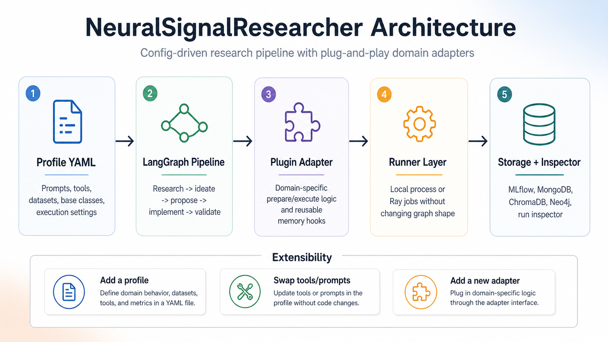

# researcher_framework

`researcher_framework` is a configuration-driven, plug-and-play research automation system built on LangGraph. It can run in two complementary modes: a structured pipeline for reproducible experiment execution, and an interactive brainstorm mode for open-ended exploration before committing to experiments. Both modes use the same profile system, memory layer, and domain adapters, so exploratory reasoning can feed directly into concrete pipeline runs.

The intent is extensibility without graph rewrites. New domains are mostly described through configuration: prompts, research tools, datasets, base classes, evaluation thresholds, storage targets, and adapter wiring. The same graph can drive local execution, async subprocess jobs, or Ray-backed runners without changing the overall profile shape.



## Two Ways To Run Research

The framework has two first-class operating modes.

### Structured Pipeline Mode

Pipeline mode is the deterministic research execution path. It starts from a research direction or a saved seed, follows the active profile's `pipeline.steps`, writes state snapshots after each node, and produces durable outputs: proposals, generated code, validation results, datasets or execution artifacts, metrics, evaluation summaries, stored memory records, and next-step recommendations.

Use pipeline mode when you already know the direction you want to test, or when a brainstorm/session/UI handoff has produced concrete proposals.

```bash
uv run python main.py --mode pipeline --profile neuralsignal --direction "attention head specialization"
uv run python main.py --profile neuralsignal --proposal-seed "proposal_seed:..."
uv run python main.py --profile neuralsignal --resume-from "experiment_result:..." --start-node implement
```

The graph remains profile-driven. For example, a profile can run the full synchronous path, use async `submit_experiment_jobs` / `check_experiment_jobs`, or start from a later node when the initial state already contains proposals or implementation plans.

### Brainstorm Mode

Brainstorm mode is the exploratory path. It is designed for cases where the agent should reason more freely before the structured pipeline takes over: compare high-level concepts, pull in prior memory, challenge assumptions, narrow open questions, sketch candidate ideas, and turn the discussion into a draft execution plan.

```bash
uv run python main.py --mode brainstorm --profile neuralsignal --direction "generalization signals across attention heads"
uv run python main.py --mode brainstorm --profile trading --resume-brainstorm "<session-id>"
```

Brainstorm sessions are configured by files such as `configs/brainstorm/default.brainstorm.yaml`. The default setup uses facilitator, skeptic, and researcher roles. The researcher role can call configured research tools, such as profile context and memory retrieval, while the facilitator maintains consensus and drafts a plan.

During a paused brainstorm session, the interactive commands are:

```text
help, continue, summary, research, plan, feedback <text>, approve_plan, execute, exit
```

The important boundary is that brainstorm mode does not replace the structured pipeline. It produces a `plan_draft` with some combination of:

- `research_direction`
- `refined_ideas`
- `proposals`
- `implementation_plans`
- constraints, exclusions, success criteria, and unresolved questions

When you run `execute`, the brainstorm handoff becomes the initial pipeline state. The pipeline then starts at the most appropriate node:

- if the brainstorm already produced `implementation_plans`, execution can start at `implement`
- if it produced `proposals`, execution starts at `plan_implementation`
- if it only produced ideas or direction, execution starts at `propose_experiments`

That handoff gives the agent room to explore and critique possibilities, while keeping experiment execution, validation, storage, and evaluation reproducible.

## What It Does

Given a direction like `"attention head specialization"`, a brainstorm handoff, or a seed from a prior run, the structured pipeline can:

1. run profile-configured research tools and score returned artifacts
2. synthesise a research summary and generate experiment ideas
3. refine ideas against available datasets, constraints, and base-class APIs
4. propose concrete experiments with datasets, hyperparameters, and success criteria
5. generate implementation plans and Python subclasses from declared base classes
6. validate generated code with deterministic contracts and pytest, with optional fix retries
7. execute or submit domain experiments through the configured adapter and runner
8. evaluate outcomes against profile thresholds and produce structured analysis
9. persist results and artifacts to MLflow, MongoDB, ChromaDB, Neo4j-backed memory, and the run inspector
10. propose follow-up directions for the next research loop

## Current Profiles

Profiles live under `configs/profiles/` and are the single source of truth for a research domain.

- `neuralsignal`: LLM internals probing and hallucination-detection research. Generates `FeatureSetBase` subclasses, creates datasets from scan snapshots, trains detector models, and evaluates metrics such as `test_auc`.
- `trading`: algorithmic trading research scaffold. Uses the same graph and profile model to generate strategy code, apply validation and risk constraints, and delegate execution to a trading adapter.

A profile controls the step list, prompts, research tools, datasets, base classes, execution mode, evaluation thresholds, and storage targets. In practice, most domain customization belongs in the profile rather than in graph code.

## Adding A New Research Domain

To add a new domain, copy an existing profile such as `configs/profiles/neuralsignal.yaml`, update the domain prompts, datasets, tools, base classes, and thresholds, then point `experiment_adapter` at a new `plugins/<domain>/adapter.py`. If the adapter implements the same small prepare/execute or async submit/check interface, the existing graph can run the new domain without structural changes.

## Example Prior Run

The current stored `neuralsignal` runs include a strong prior result for `per_projection_residual_entropy`:

- `test_auc`: `0.8787`
- `test_f1`: `0.8023`
- dataset size: `500` rows
- feature count: `1009`
- MLflow run id: `05e5f6d617614a3bacd5e38fc5ac68d6`

That run produced more than a metric. It also generated an implementation, experiment metadata, evaluation analysis, and follow-up directions. The stored analysis concluded that per-head claim-ratio features carried the strongest hallucination signal, while the paired weaker proposal in the same batch overfit badly and did not generalize. That is the intended output shape of the framework: code, experiments, evaluation, storage, and next-step recommendations rather than a single isolated score.

## Architecture Overview

The architecture is split into a few stable layers:

- `configs/profiles/<name>.yaml`: domain definition for prompts, tools, datasets, base classes, execution, and thresholds
- `core/graph/nodes/<step>.py`: reusable graph nodes that read the profile and return state deltas
- `core.plugins.<domain>.adapter`: domain-specific execution logic for dataset creation, training, backtests, or other heavy operations
- runner layer: local subprocesses or Ray jobs behind the same async job interface
- storage and memory: MLflow, MongoDB, ChromaDB, Neo4j, and the run inspector UI

Key design rules:

- nodes do not hardcode domain prompts or dataset names
- generated code must subclass a base class declared by the active profile
- adapters own domain-specific execution details
- runners are swappable without changing graph semantics
- all durable outputs are written back into structured state and persisted

The run inspector reads those stored records back into a single view so prior directions, generated code, metrics, artifacts, and follow-up seeds can be inspected together.

---

## Research Tools

The `research` node is modular. Profiles declare which tools to run, and each tool returns structured artifacts. The node then asks the LLM to score each artifact with `prompts.research.artifact_score_system`, filters by the tool's threshold, and writes the selected artifacts to `state['research_artifacts']`.

Built-in tools:

| Tool | Purpose |
|---|---|
| `tools.research_tools.collect_arxiv` | Search arXiv and return paper artifacts |
| `tools.research_tools.collect_prior_experiments` | Retrieve similar past experiments from ChromaDB |
| `tools.research_tools.collect_adapter_context` | Ask the active domain adapter for environment or platform context |
| `tools.research_tools.collect_profile_context` | Expose selected profile sections as scoreable artifacts |
| `tools.research_tools.collect_strategy_library` | Inspect a local trading platform tree for strategy, backtest, and risk files |
| `core.tools.research_tools.collect_memory` | Retrieve profile-scoped prior memory records for reuse and grounding |

Custom tools should implement:

```python
def collect_x(direction: str, profile: dict, tool_cfg: dict, state: dict) -> list[dict]:
    ...
```

Each returned artifact should include `artifact_id`, `source`, `source_type`, `title`, `summary`, `metadata`, and optional `raw`.

---

## Memory System

The project includes a canonical memory layer under `core/memory/` for:

- semantic retrieval of prior runs and profile objects
- exact-match reuse of deterministic artifacts such as datasets
- profile-specific object memory without hardcoding domain schemas into the graph

Core ideas:

- `MemoryRecord` is the generic envelope persisted by the system
- adapters own profile-specific memory construction via `build_memory_records(...)`
- `research` reads memory through retrieval tools
- `store_results` persists memory through `MemoryService`

The memory envelope distinguishes:

- `kind`: retrieval or use-case class
- `object_type`: canonical object class such as `dataset`, `featureset`, `model`, `experiment_result`, `algorithm`, `portfolio`, `backtest`
- `object_key`: stable object identity
- `object_role`: how the object is being remembered, such as `artifact`, `implementation`, or `result`

For deterministic reuse, adapters can persist exact-match fingerprints in record metadata. The current `neuralsignal` adapter stores `dataset_config_fingerprint` and checks memory before creating a dataset. If an identical ready dataset already exists and its referenced file still exists, it reuses that dataset instead of recomputing it.

Full documentation:

- [`docs/memory.md`](docs/memory.md)

---

## Async Experiment Jobs

Long-running experiments can run asynchronously so the graph does not block on a single synchronous process. Profiles opt into this by using `submit_experiment_jobs` and `check_experiment_jobs` in the step list and by defining execution settings in the profile.

The runner interface is intentionally small so the same graph can target different execution backends. The implemented runners are `local_process` and `ray`. They launch the same dotted task callables used by the synchronous path, and additional runners can plug in with the same `submit` and `check` behavior.

Each async job is durable on disk under `dev/experiments/<profile>/jobs/<job_id>/` and typically includes:

```text
job.json
payload.json
status.json
result.json
stdout.log
stderr.log
```

The graph state stores lightweight job metadata in `state['experiment_jobs']`. `submit_experiment_jobs` submits work up to `execution.max_parallel_jobs`. `check_experiment_jobs` polls existing jobs, collects completed results into `experiment_artifacts`, `experiment_results`, and `models`, and can submit the next stage automatically when `auto_submit_next_stage` is enabled.

---

## neuralsignal Plugin

The `neuralsignal` plugin generates `FeatureSetBase` subclasses and runs NeuralSignal automation through isolated subprocess tasks. It supports both synchronous adapter methods and the async job-node flow used by the `neuralsignal` profile.

The current NeuralSignal integration adds several safety and compatibility layers:

- generated feature sets are wrapped so common real scan-shape variants still work when code assumes `outputs[0][layer_id]`
- empty feature outputs fail loudly instead of silently producing target-only CSVs
- balanced dataset pulls are supported through profile config
- long-running Mongo scan iteration uses `no_cursor_timeout=True` to reduce `CursorNotFound` failures during dataset builds
- model tasks run from the dataset directory so NeuralSignal's current `file_out` handling resolves the real CSV correctly

The async NeuralSignal task chain is:

```text
submit_experiment_jobs
  -> plugins.job_runner.LocalProcessRunner or Ray runner
    -> plugins.neuralsignal.tasks.create_dataset
      -> neuralsignal.automation.create_dataset

check_experiment_jobs
  -> collect dataset result.json
  -> submit model job
    -> plugins.neuralsignal.tasks.create_s1_model
      -> neuralsignal.automation.create_s1_model
```

The task wrapper merges the agent payload over NeuralSignal's packaged automation defaults, then injects the generated feature set through a real NeuralSignal `FeatureProcessor`.

---

## Trading Plugin

The `trading` profile is wired into the same graph and research-tool infrastructure. It currently provides prompts, risk constraints, research tools, and a plugin scaffold in `plugins/trading/adapter.py`.

To run trading experiments end to end, the adapter is expected to load the generated strategy class, run a leakage-safe backtest with configured costs and slippage, and return normalized metrics such as `sharpe_ratio`, `max_drawdown`, `annual_return`, `turnover`, and `win_rate`.

---

## Configuration

| File | Purpose |
|---|---|
| `configs/config.yaml` | Global runtime settings: backends, timeouts, paths, logging, and execution defaults |
| `configs/.env` | Optional local secret and environment overrides |
| `configs/profiles/*.yaml` | Per-domain research profiles: steps, prompts, datasets, tools, thresholds, and storage |

The generated-work tree is rooted at `dev_root`, which defaults to `dev/`. The runtime also performs a periodic best-effort cleanup of disposable files under that root using `maintenance.dev_cleanup` in `configs/config.yaml`.

Logging writes the main application stream to `logs/research.log`. Plugin-specific adapter and subprocess logs can also be routed to plugin-named files such as `logs/research.neuralsignal.log` to keep subprocess-heavy domains separate from the main pipeline log.

---

## Tests

The repository test suite runs under `pytest`. Generated validation tests are written to `dev/experiments/<profile>/tests/` and can be executed automatically during the pipeline. Pytest is configured to keep its cache and temp files under `.tmp/pytest/` instead of scattering `.pytest_*` directories across the project root.

---

## Dev Artifacts

All generated artifacts are local and gitignored under `dev/`. Async experiment jobs are stored under `dev/experiments/<profile>/jobs/<job_id>/` with payloads, status, results, stdout, and stderr logs.

Typical generated structure:

```text
dev/
+-- state/                  # JSON state snapshots
+-- experiments/
|   +-- <profile>/
|       +-- implementations/  # cached LLM-generated subclass scripts
|       +-- datasets/         # created feature CSVs
|       +-- jobs/             # async job payloads and results
|       +-- tests/            # generated pytest files
+-- papers/                 # arXiv digest cache
```
